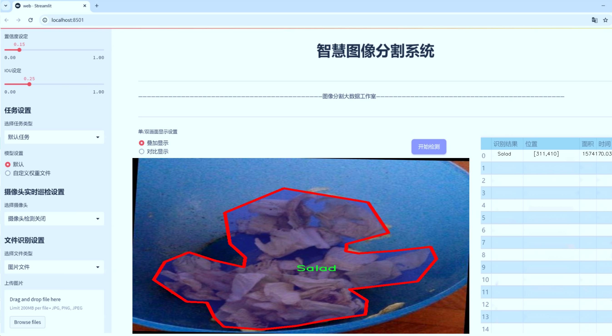

# 食品图像分割系统源码＆数据集分享
 [yolov8-seg-C2f-ContextGuided＆yolov8-seg-C2f-DCNV2等50+全套改进创新点发刊_一键训练教程_Web前端展示]

### 1.研究背景与意义

项目参考[ILSVRC ImageNet Large Scale Visual Recognition Challenge](https://gitee.com/YOLOv8_YOLOv11_Segmentation_Studio/projects)

项目来源[AAAI Global Al lnnovation Contest](https://kdocs.cn/l/cszuIiCKVNis)

研究背景与意义

随着信息技术的迅猛发展，计算机视觉领域的研究逐渐深入，尤其是在图像分割和物体检测方面的应用越来越广泛。食品图像的处理与分析作为计算机视觉的重要分支，正逐渐成为食品安全、营养分析、智能餐饮等领域的研究热点。食品图像分割不仅可以帮助识别和分类不同类型的食品，还能为后续的营养成分分析、质量评估和自动化烹饪提供重要的数据支持。因此，构建一个高效、准确的食品图像分割系统具有重要的理论价值和实际意义。

YOLO（You Only Look Once）系列模型因其高效的实时检测能力而受到广泛关注。YOLOv8作为该系列的最新版本，在精度和速度上均有显著提升。然而，针对特定领域的应用，如食品图像分割，现有的YOLOv8模型在处理复杂背景、不同光照条件和多样化食品形态时，仍存在一定的局限性。因此，基于改进YOLOv8的食品图像分割系统的研究，旨在通过优化模型结构和算法，提升其在食品图像处理中的表现，进而推动相关应用的发展。

本研究将利用“Food items with Reference Objects”数据集，该数据集包含1500张食品图像，涵盖18种不同类别的食品，如苹果、面包、鸡肉、鱼、意大利面等。这些食品类别的多样性为模型的训练提供了丰富的样本，能够有效提高模型的泛化能力。同时，数据集中包含的参考物体（如硬币）为模型提供了尺度和位置的参考，有助于提高分割的准确性和鲁棒性。通过对这些图像进行实例分割，不仅可以实现对食品的精确识别，还能为食品的外观分析、质量控制和营养成分评估提供重要依据。

在食品安全日益受到重视的背景下，智能化的食品检测与分析系统显得尤为重要。基于改进YOLOv8的食品图像分割系统的研究，不仅能够提升食品图像处理的效率和准确性，还能为智能餐饮、自动化厨房等应用场景提供技术支持。此外，该系统的成功实施将为食品行业的数字化转型提供新的思路，推动食品产业的智能化发展。

综上所述，基于改进YOLOv8的食品图像分割系统的研究，具有重要的理论意义和广泛的应用前景。通过深入探索食品图像分割技术，我们不仅能够提升计算机视觉在食品领域的应用水平，还能为实现食品安全、营养健康和智能化服务贡献力量。

### 2.图片演示





##### 注意：由于此博客编辑较早，上面“2.图片演示”和“3.视频演示”展示的系统图片或者视频可能为老版本，新版本在老版本的基础上升级如下：（实际效果以升级的新版本为准）

  （1）适配了YOLOV8的“目标检测”模型和“实例分割”模型，通过加载相应的权重（.pt）文件即可自适应加载模型。

  （2）支持“图片识别”、“视频识别”、“摄像头实时识别”三种识别模式。

  （3）支持“图片识别”、“视频识别”、“摄像头实时识别”三种识别结果保存导出，解决手动导出（容易卡顿出现爆内存）存在的问题，识别完自动保存结果并导出到tempDir中。

  （4）支持Web前端系统中的标题、背景图等自定义修改，后面提供修改教程。

  另外本项目提供训练的数据集和训练教程,暂不提供权重文件（best.pt）,需要您按照教程进行训练后实现图片演示和Web前端界面演示的效果。

### 3.视频演示

[3.1 视频演示](https://www.bilibili.com/video/BV1rhyzYcEBA/)

### 4.数据集信息展示

##### 4.1 本项目数据集详细数据（类别数＆类别名）

nc: 18
names: ['Apple', 'Bread', 'Chicken', 'Egg', 'Fish', 'Pasta', 'Pizza', 'Rice', 'Salad', 'Water', 'banana', 'coin', 'kiwi', 'lemon', 'lychee', 'mango', 'orange', 'tomato']


##### 4.2 本项目数据集信息介绍

数据集信息展示

在现代计算机视觉领域，图像分割技术的进步为多种应用场景提供了强有力的支持，尤其是在食品图像分析方面。为进一步提升YOLOv8-seg模型在食品图像分割任务中的表现，我们选用了名为“Food items with Reference Objects”的数据集。该数据集专门针对食品图像进行了精心设计，包含了丰富的类别和多样的图像样本，为模型的训练和评估提供了坚实的基础。

该数据集包含18个不同的食品类别，具体包括：苹果、面包、鸡肉、鸡蛋、鱼、意大利面、比萨、米饭、沙拉、水、香蕉、硬币、猕猴桃、柠檬、荔枝、芒果、橙子和西红柿。这些类别不仅涵盖了常见的食品项，还引入了一些参考物体，如硬币，以帮助模型在复杂背景下进行更为准确的分割。通过将食品与参考物体结合，数据集能够有效地模拟真实世界中的场景，增强模型对不同环境的适应能力。

在数据集的构建过程中，图像的采集和标注是至关重要的环节。每一类食品图像都经过精心挑选，确保其在色彩、形状和纹理上的多样性，以便模型能够学习到更为丰富的特征。标注工作则由专业人员完成，确保每个图像中的食品项都被准确地框定和标记。这种高质量的标注不仅提高了数据集的可靠性，也为后续的模型训练提供了准确的监督信号。

此外，数据集的图像分辨率和质量也经过严格把控，以保证模型在训练过程中能够获得清晰的视觉信息。图像的多样性和高质量标注使得“Food items with Reference Objects”数据集成为训练YOLOv8-seg模型的理想选择。通过对这些食品图像的深入学习，模型能够逐步掌握不同食品的特征，从而在实际应用中实现更为精准的分割效果。

在模型训练过程中，数据集的使用不仅限于单一的训练阶段，还包括验证和测试阶段。通过将数据集划分为训练集、验证集和测试集，研究人员能够全面评估模型的性能，确保其在不同场景下的泛化能力。这种系统化的评估方法使得模型在实际应用中能够表现出色，能够应对各种复杂的食品图像分割任务。

总之，“Food items with Reference Objects”数据集为改进YOLOv8-seg的食品图像分割系统提供了丰富的资源和强大的支持。通过对该数据集的深入分析和利用，研究人员不仅能够提升模型的性能，还能够推动食品图像分析领域的进一步发展。未来，随着数据集的不断扩展和更新，我们有理由相信，基于此数据集的研究将为食品图像分割技术带来更多的创新和突破。


### 5.全套项目环境部署视频教程（零基础手把手教学）

[5.1 环境部署教程链接（零基础手把手教学）](https://www.bilibili.com/video/BV1jG4Ve4E9t/?vd_source=bc9aec86d164b67a7004b996143742dc)


[5.2 安装Python虚拟环境创建和依赖库安装视频教程链接（零基础手把手教学）](https://www.bilibili.com/video/BV1nA4VeYEze/?vd_source=bc9aec86d164b67a7004b996143742dc)

### 6.手把手YOLOV8-seg训练视频教程（零基础小白有手就能学会）

[6.1 手把手YOLOV8-seg训练视频教程（零基础小白有手就能学会）](https://www.bilibili.com/video/BV1cA4VeYETe/?vd_source=bc9aec86d164b67a7004b996143742dc)


按照上面的训练视频教程链接加载项目提供的数据集，运行train.py即可开始训练



     Epoch   gpu_mem       box       obj       cls    labels  img_size
     1/200     0G   0.01576   0.01955  0.007536        22      1280: 100%|██████████| 849/849 [14:42<00:00,  1.04s/it]
               Class     Images     Labels          P          R     mAP@.5 mAP@.5:.95: 100%|██████████| 213/213 [01:14<00:00,  2.87it/s]
                 all       3395      17314      0.994      0.957      0.0957      0.0843

     Epoch   gpu_mem       box       obj       cls    labels  img_size
     2/200     0G   0.01578   0.01923  0.007006        22      1280: 100%|██████████| 849/849 [14:44<00:00,  1.04s/it]
               Class     Images     Labels          P          R     mAP@.5 mAP@.5:.95: 100%|██████████| 213/213 [01:12<00:00,  2.95it/s]
                 all       3395      17314      0.996      0.956      0.0957      0.0845

     Epoch   gpu_mem       box       obj       cls    labels  img_size
     3/200     0G   0.01561    0.0191  0.006895        27      1280: 100%|██████████| 849/849 [10:56<00:00,  1.29it/s]
               Class     Images     Labels          P          R     mAP@.5 mAP@.5:.95: 100%|███████   | 187/213 [00:52<00:00,  4.04it/s]
                 all       3395      17314      0.996      0.957      0.0957      0.0845


### 7.50+种全套YOLOV8-seg创新点代码加载调参视频教程（一键加载写好的改进模型的配置文件）

[7.1 50+种全套YOLOV8-seg创新点代码加载调参视频教程（一键加载写好的改进模型的配置文件）](https://www.bilibili.com/video/BV1Hw4VePEXv/?vd_source=bc9aec86d164b67a7004b996143742dc)

### 8.YOLOV8-seg图像分割算法原理

原始YOLOV8-seg算法原理

YOLOv8-seg算法是YOLO系列中的一项重要进展，旨在解决目标检测和分割任务中的诸多挑战。与传统的anchor-based检测方法相比，YOLOv8采用了anchor-free的设计理念，这一创新不仅提升了检测精度，还显著加快了检测速度。这一转变使得YOLOv8在处理复杂场景时，尤其是在水面环境中，对于小目标的检测能力得到了增强。然而，尽管YOLOv8在多方面表现出色，但在面对小目标漂浮物时，仍然存在定位误差和目标感知能力不足的问题，这促使研究者们对YOLOv8进行进一步的改进，提出了YOLOv8-WSSOD算法。

YOLOv8的网络结构可以分为四个主要模块：输入端、主干网络、Neck端和输出端。输入端负责对输入图像进行预处理，包括Mosaic数据增强、自适应图片缩放和灰度填充等。这些预处理步骤旨在提高模型对不同场景的适应能力，确保在多样化的背景下仍能有效提取特征。主干网络则通过卷积、池化等操作提取图像特征，其中C2f模块是特征学习的核心，结合了YOLOv7的ELAN结构，增强了模型的梯度流动性，从而提升了特征表示能力。

在Neck端，YOLOv8采用了路径聚合网络（PAN）结构，通过上采样、下采样和特征拼接的方式，有效融合了不同尺度的特征图。这一设计使得模型能够更好地处理多尺度目标，尤其是在复杂环境中，能够提高对小目标的检测能力。输出端则使用了decoupled head结构，实现了分类和回归过程的解耦，进一步提高了模型的灵活性和效率。

YOLOv8在损失计算方面也进行了创新，采用了Task-Aligned Assigner方法，对分类分数和回归分数进行加权，从而更准确地匹配正样本。分类损失使用了二元交叉熵损失（BCE），而回归损失则结合了分布焦点损失（DFL）和完全交并比损失（CIoU），这使得模型在边界框预测的准确性上得到了显著提升。

尽管YOLOv8在多个方面表现出色，但在实际应用中，尤其是在复杂水面环境下，小目标的检测仍然是一个亟待解决的问题。为此，YOLOv8-WSSOD算法应运而生。该算法首先引入了捕获远程依赖的思想，采用BiFormer双层路由注意力机制构建C2fBF模块，旨在减轻主干网络下采样过程中的噪声影响，并保留特征提取过程中更细粒度的上下文信息。这一改进使得模型在处理复杂背景时，能够更好地理解目标与背景之间的关系，从而提高了小目标的检测能力。

针对小目标漏检的问题，YOLOv8-WSSOD算法还添加了一个更小的检测头，以提升网络对小目标的感知力。此外，在Neck端引入了GSConv和Slim-neck技术，这不仅保持了模型的精度，还有效降低了计算量，进一步提升了实时检测的能力。最后，YOLOv8-WSSOD算法使用了MPDIoU损失函数替换了CIoU损失函数，这一改进旨在提高模型的泛化能力和精准度，使其在多种复杂场景下均能表现出色。

综上所述，YOLOv8-seg算法通过一系列创新设计，尤其是在网络结构、损失计算和特征融合等方面的改进，极大地提升了目标检测和分割的性能。尽管在复杂水面环境下仍面临挑战，但YOLOv8-WSSOD算法的提出为解决这些问题提供了新的思路和方法。通过引入更先进的注意力机制和优化的检测头设计，YOLOv8-seg算法展现出了更强的目标感知能力和更高的检测精度，为未来的研究和应用奠定了坚实的基础。


### 9.系统功能展示（检测对象为举例，实际内容以本项目数据集为准）

图9.1.系统支持检测结果表格显示

  图9.2.系统支持置信度和IOU阈值手动调节

  图9.3.系统支持自定义加载权重文件best.pt(需要你通过步骤5中训练获得)

  图9.4.系统支持摄像头实时识别

  图9.5.系统支持图片识别

  图9.6.系统支持视频识别

  图9.7.系统支持识别结果文件自动保存

  图9.8.系统支持Excel导出检测结果数据


### 10.50+种全套YOLOV8-seg创新点原理讲解（非科班也可以轻松写刊发刊，V11版本正在科研待更新）

#### 10.1 由于篇幅限制，每个创新点的具体原理讲解就不一一展开，具体见下列网址中的创新点对应子项目的技术原理博客网址【Blog】：


[10.1 50+种全套YOLOV8-seg创新点原理讲解链接](https://gitee.com/qunmasj/good)

#### 10.2 部分改进模块原理讲解(完整的改进原理见上图和技术博客链接)【如果此小节的图加载失败可以通过CSDN或者Github搜索该博客的标题访问原始博客，原始博客图片显示正常】
### YOLOv8简介
#### Neck模块设计
骨干网络和 Neck 的具体变化为：

第一个卷积层的 kernel 从 6x6 变成了 3x3
所有的 C3 模块换成 C2f，结构如下所示，可以发现多了更多的跳层连接和额外的 Split 操作


去掉了 Neck 模块中的 2 个卷积连接层
Backbone 中 C2f 的 block 数从 3-6-9-3 改成了 3-6-6-3
查看 N/S/M/L/X 等不同大小模型，可以发现 N/S 和 L/X 两组模型只是改了缩放系数，但是 S/M/L 等骨干网络的通道数设置不一样，没有遵循同一套缩放系数。如此设计的原因应该是同一套缩放系数下的通道设置不是最优设计，YOLOv7 网络设计时也没有遵循一套缩放系数作用于所有模型。

#### Head模块设计
Head 部分变化最大，从原先的耦合头变成了解耦头，并且从 YOLOv5 的 Anchor-Based 变成了 Anchor-Free。其结构如下所示：


可以看出，不再有之前的 objectness 分支，只有解耦的分类和回归分支，并且其回归分支使用了 Distribution Focal Loss 中提出的积分形式表示法。

#### Loss 计算
Loss 计算过程包括 2 个部分： 正负样本分配策略和 Loss 计算。 现代目标检测器大部分都会在正负样本分配策略上面做文章，典型的如 YOLOX 的 simOTA、TOOD 的 TaskAlignedAssigner 和 RTMDet 的 DynamicSoftLabelAssigner，这类 Assigner 大都是动态分配策略，而 YOLOv5 采用的依然是静态分配策略。考虑到动态分配策略的优异性，YOLOv8 算法中则直接引用了 TOOD 的 TaskAlignedAssigner。 TaskAlignedAssigner 的匹配策略简单总结为： 根据分类与回归的分数加权的分数选择正样本。

s 是标注类别对应的预测分值，u 是预测框和 gt 框的 iou，两者相乘就可以衡量对齐程度。

对于每一个 GT，对所有的预测框基于 GT 类别对应分类分数，预测框与 GT 的 IoU 的加权得到一个关联分类以及回归的对齐分数 alignment_metrics 。
对于每一个 GT，直接基于 alignment_metrics 对齐分数选取 topK 大的作为正样本
Loss 计算包括 2 个分支： 分类和回归分支，没有了之前的 objectness 分支。
分类分支依然采用 BCE Loss
回归分支需要和 Distribution Focal Loss 中提出的积分形式表示法绑定，因此使用了 Distribution Focal Loss， 同时还使用了 CIoU Loss
Loss 采用一定权重比例加权即可。
#### 训练数据增强
数据增强方面和 YOLOv5 差距不大，只不过引入了 YOLOX 中提出的最后 10 个 epoch 关闭 Mosaic 的操作。假设训练 epoch 是 500，其示意图如下所示：

### RCS-OSA的基本原理
参考该博客，RCSOSA（RCS-One-Shot Aggregation）是RCS-YOLO中提出的一种结构，我们可以将主要原理概括如下：

1. RCS（Reparameterized Convolution based on channel Shuffle）: 结合了通道混洗，通过重参数化卷积来增强网络的特征提取能力。

2. RCS模块: 在训练阶段，利用多分支结构学习丰富的特征表示；在推理阶段，通过结构化重参数化简化为单一分支，减少内存消耗。

3. OSA（One-Shot Aggregation）: 一次性聚合多个特征级联，减少网络计算负担，提高计算效率。

4. 特征级联: RCS-OSA模块通过堆叠RCS，确保特征的复用并加强不同层之间的信息流动。

#### RCS
RCS（基于通道Shuffle的重参数化卷积）是RCS-YOLO的核心组成部分，旨在训练阶段通过多分支结构学习丰富的特征信息，并在推理阶段通过简化为单分支结构来减少内存消耗，实现快速推理。此外，RCS利用通道分割和通道Shuffle操作来降低计算复杂性，同时保持通道间的信息交换，这样在推理阶段相比普通的3×3卷积可以减少一半的计算复杂度。通过结构重参数化，RCS能够在训练阶段从输入特征中学习深层表示，并在推理阶段实现快速推理，同时减少内存消耗。

#### RCS模块
RCS（基于通道Shuffle的重参数化卷积）模块中，结构在训练阶段使用多个分支，包括1x1和3x3的卷积，以及一个直接的连接（Identity），用于学习丰富的特征表示。在推理阶段，结构被重参数化成一个单一的3x3卷积，以减少计算复杂性和内存消耗，同时保持训练阶段学到的特征表达能力。这与RCS的设计理念紧密相连，即在不牺牲性能的情况下提高计算效率。


上图为大家展示了RCS的结构，分为训练阶段（a部分）和推理阶段（b部分）。在训练阶段，输入通过通道分割，一部分输入经过RepVGG块，另一部分保持不变。然后通过1x1卷积和3x3卷积处理RepVGG块的输出，与另一部分输入进行通道Shuffle和连接。在推理阶段，原来的多分支结构被简化为一个单一的3x3 RepConv块。这种设计允许在训练时学习复杂特征，在推理时减少计算复杂度。黑色边框的矩形代表特定的模块操作，渐变色的矩形代表张量的特定特征，矩形的宽度代表张量的通道数。 

#### OSA
OSA（One-Shot Aggregation）是一个关键的模块，旨在提高网络在处理密集连接时的效率。OSA模块通过表示具有多个感受野的多样化特征，并在最后的特征映射中仅聚合一次所有特征，从而克服了DenseNet中密集连接的低效率问题。

OSA模块的使用有两个主要目的：

1. 提高特征表示的多样性：OSA通过聚合具有不同感受野的特征来增加网络对于不同尺度的敏感性，这有助于提升模型对不同大小目标的检测能力。

2. 提高效率：通过在网络的最后一部分只进行一次特征聚合，OSA减少了重复的特征计算和存储需求，从而提高了网络的计算和能源效率。

在RCS-YOLO中，OSA模块被进一步与RCS（基于通道Shuffle的重参数化卷积）相结合，形成RCS-OSA模块。这种结合不仅保持了低成本的内存消耗，而且还实现了语义信息的有效提取，对于构建轻量级和大规模的对象检测器尤为重要。

下面我将为大家展示RCS-OSA（One-Shot Aggregation of RCS）的结构。


在RCS-OSA模块中，输入被分为两部分，一部分直接通过，另一部分通过堆叠的RCS模块进行处理。处理后的特征和直接通过的特征在通道混洗（Channel Shuffle）后合并。这种结构设计用于增强模型的特征提取和利用效率，是RCS-YOLO架构中的一个关键组成部分旨在通过一次性聚合来提高模型处理特征的能力，同时保持计算效率。

#### 特征级联
特征级联（feature cascade）是一种技术，通过在网络的一次性聚合（one-shot aggregate）路径上维持有限数量的特征级联来实现的。在RCS-YOLO中，特别是在RCS-OSA（RCS-Based One-Shot Aggregation）模块中，只保留了三个特征级联。

特征级联的目的是为了减轻网络计算负担并降低内存占用。这种方法可以有效地聚合不同层次的特征，提高模型的语义信息提取能力，同时避免了过度复杂化网络结构所带来的低效率和高资源消耗。

下面为大家提供的图像展示的是RCS-YOLO的整体架构，其中包括RCS-OSA模块。RCS-OSA在模型中用于堆叠RCS模块，以确保特征的复用并加强不同层之间的信息流动。图中显示的多层RCS-OSA模块的排列和组合反映了它们如何一起工作以优化特征传递和提高检测性能。


总结：RCS-YOLO主要由RCS-OSA（蓝色模块）和RepVGG（橙色模块）构成。这里的n代表堆叠RCS模块的数量。n_cls代表检测到的对象中的类别数量。图中的IDetect是从YOLOv7中借鉴过来的，表示使用二维卷积神经网络的检测层。这个架构通过堆叠的RCS模块和RepVGG模块，以及两种类型的检测层，实现了对象检测的任务。 


### 11.项目核心源码讲解（再也不用担心看不懂代码逻辑）

#### 11.1 ultralytics\utils\errors.py

以下是经过简化和注释的核心代码部分：

```python
# 导入emojis工具，用于处理错误信息中的表情符号
from ultralytics.utils import emojis

class HUBModelError(Exception):
    """
    自定义异常类，用于处理与Ultralytics YOLO模型获取相关的错误。

    当请求的模型未找到或无法检索时，将引发此异常。
    异常消息经过处理，以便于用户体验，包含表情符号。

    属性:
        message (str): 异常引发时显示的错误消息。
    """

    def __init__(self, message='Model not found. Please check model URL and try again.'):
        """初始化模型未找到的异常，并处理消息以包含表情符号。"""
        # 调用父类的构造函数，并使用emojis函数处理消息
        super().__init__(emojis(message))
```

### 代码说明：
1. **导入模块**：从`ultralytics.utils`导入`emojis`函数，用于在异常消息中添加表情符号，以增强用户体验。
  
2. **自定义异常类**：`HUBModelError`类继承自Python内置的`Exception`类，用于表示特定的错误情况（模型未找到）。

3. **构造函数**：
   - `__init__`方法接受一个可选的消息参数，默认值为“模型未找到，请检查模型URL并重试”。
   - 在构造函数中，调用父类的构造函数，并将处理过的消息传递给它，确保用户看到的错误信息更友好。

这个类的核心功能是提供一个自定义的异常处理机制，以便在模型获取失败时给出清晰且友好的反馈。

这个文件是Ultralytics YOLO项目中的一个错误处理模块，主要定义了一个自定义异常类`HUBModelError`。该类用于处理与模型获取相关的错误，例如当请求的模型未找到或无法检索时，会抛出这个异常。

在这个类的文档字符串中，详细说明了它的用途和属性。`HUBModelError`类继承自Python内置的`Exception`类，意味着它可以像其他异常一样被捕获和处理。它的构造函数接受一个可选的消息参数，默认值为“Model not found. Please check model URL and try again.”，这条消息会在异常被抛出时显示给用户。

为了增强用户体验，异常消息会通过`ultralytics.utils`包中的`emojis`函数进行处理。这意味着在显示错误信息时，可能会包含一些表情符号，使得信息更加生动和易于理解。

总的来说，这个文件的主要功能是提供一个清晰的方式来处理模型相关的错误，并通过表情符号提升用户的交互体验。

#### 11.2 ultralytics\utils\ops.py

以下是代码中最核心的部分，并附上详细的中文注释：

```python
import torch
import torchvision

def non_max_suppression(
        prediction,
        conf_thres=0.25,
        iou_thres=0.45,
        classes=None,
        agnostic=False,
        multi_label=False,
        labels=(),
        max_det=300,
        nc=0,  # 类别数量（可选）
        max_time_img=0.05,
        max_nms=30000,
        max_wh=7680,
):
    """
    对一组边界框执行非最大抑制（NMS），支持掩码和每个框多个标签。

    参数：
        prediction (torch.Tensor): 形状为 (batch_size, num_classes + 4 + num_masks, num_boxes) 的张量，
            包含预测的框、类别和掩码。张量应符合模型输出格式，例如 YOLO。
        conf_thres (float): 置信度阈值，低于该值的框将被过滤。有效值在 0.0 和 1.0 之间。
        iou_thres (float): IoU 阈值，低于该值的框在 NMS 过程中将被过滤。有效值在 0.0 和 1.0 之间。
        classes (List[int]): 要考虑的类别索引列表。如果为 None，则考虑所有类别。
        agnostic (bool): 如果为 True，模型对类别数量不敏感，所有类别将被视为一个。
        multi_label (bool): 如果为 True，每个框可能有多个标签。
        labels (List[List[Union[int, float, torch.Tensor]]]): 每个图像的先验标签列表。列表应符合
            数据加载器输出格式，每个标签为 (class_index, x1, y1, x2, y2) 的元组。
        max_det (int): NMS 后要保留的最大框数量。
        nc (int, optional): 模型输出的类别数量。任何超出此数量的索引将被视为掩码。
        max_time_img (float): 处理一张图像的最大时间（秒）。
        max_nms (int): 传递给 torchvision.ops.nms() 的最大框数量。
        max_wh (int): 框的最大宽度和高度（像素）。

    返回：
        (List[torch.Tensor]): 长度为 batch_size 的列表，每个元素是形状为 (num_boxes, 6 + num_masks) 的张量，
            包含保留的框，列为 (x1, y1, x2, y2, 置信度, 类别, mask1, mask2, ...)。
    """

    # 检查置信度和IoU阈值的有效性
    assert 0 <= conf_thres <= 1, f'无效的置信度阈值 {conf_thres}, 有效值在 0.0 和 1.0 之间'
    assert 0 <= iou_thres <= 1, f'无效的IoU {iou_thres}, 有效值在 0.0 和 1.0 之间'
    
    # 处理模型输出
    if isinstance(prediction, (list, tuple)):  # YOLOv8模型在验证模式下，输出 = (推理输出, 损失输出)
        prediction = prediction[0]  # 选择仅推理输出

    device = prediction.device  # 获取设备信息
    bs = prediction.shape[0]  # 批大小
    nc = nc or (prediction.shape[1] - 4)  # 类别数量
    nm = prediction.shape[1] - nc - 4  # 掩码数量
    mi = 4 + nc  # 掩码起始索引
    xc = prediction[:, 4:mi].amax(1) > conf_thres  # 置信度候选框

    # 设置
    time_limit = 0.5 + max_time_img * bs  # 超过此时间限制将退出
    multi_label &= nc > 1  # 多标签每框（增加0.5ms/图像）

    prediction = prediction.transpose(-1, -2)  # 转置形状
    prediction[..., :4] = xywh2xyxy(prediction[..., :4])  # 将xywh转换为xyxy

    output = [torch.zeros((0, 6 + nm), device=prediction.device)] * bs  # 初始化输出
    for xi, x in enumerate(prediction):  # 遍历每张图像的推理结果
        x = x[xc[xi]]  # 仅保留置信度高的框

        # 如果没有框，处理下一张图像
        if not x.shape[0]:
            continue

        # Detections矩阵 nx6 (xyxy, conf, cls)
        box, cls, mask = x.split((4, nc, nm), 1)  # 分离框、类别和掩码

        if multi_label:
            i, j = torch.where(cls > conf_thres)  # 找到多标签框
            x = torch.cat((box[i], x[i, 4 + j, None], j[:, None].float(), mask[i]), 1)
        else:  # 仅保留最佳类别
            conf, j = cls.max(1, keepdim=True)
            x = torch.cat((box, conf, j.float(), mask), 1)[conf.view(-1) > conf_thres]

        # 过滤类别
        if classes is not None:
            x = x[(x[:, 5:6] == torch.tensor(classes, device=x.device)).any(1)]

        n = x.shape[0]  # 框的数量
        if not n:  # 如果没有框
            continue
        if n > max_nms:  # 如果框数量过多
            x = x[x[:, 4].argsort(descending=True)[:max_nms]]  # 按置信度排序并去除多余框

        # 批量NMS
        c = x[:, 5:6] * (0 if agnostic else max_wh)  # 类别
        boxes, scores = x[:, :4] + c, x[:, 4]  # 框（按类别偏移），分数
        i = torchvision.ops.nms(boxes, scores, iou_thres)  # NMS
        i = i[:max_det]  # 限制检测数量

        output[xi] = x[i]  # 保存结果
        if (time.time() - t) > time_limit:  # 检查时间限制
            break  # 超过时间限制

    return output  # 返回处理后的框
```

### 代码核心部分说明：
1. **非最大抑制（NMS）**：该函数的主要功能是对检测到的边界框进行筛选，去除重叠度高且置信度低的框，保留最有可能的目标检测结果。
2. **参数设置**：函数接收多个参数，包括置信度阈值、IoU阈值、类别过滤等，允许用户根据需求自定义筛选条件。
3. **框的处理**：通过对模型输出的处理，提取出框、类别和掩码信息，并根据置信度进行筛选。
4. **批量处理**：支持对多张图像的批量处理，优化了计算效率。
5. **返回结果**：最终返回经过非最大抑制处理后的边界框列表，方便后续的目标检测任务。

这个程序文件是Ultralytics YOLO（You Only Look Once）模型的一部分，主要包含了一些用于图像处理和目标检测的实用函数。代码中涉及的功能包括时间性能分析、边界框的转换、非极大值抑制（NMS）、坐标缩放、掩膜处理等。

首先，`Profile`类用于性能分析，可以作为装饰器或上下文管理器使用。它记录代码块的执行时间，方便开发者优化代码性能。

`segment2box`函数将分割标签转换为边界框标签，确保生成的边界框在图像内部。它接受一个分割标签的张量和图像的宽高，并返回最小和最大x、y值的数组。

`scale_boxes`函数用于将边界框从一个图像的尺寸缩放到另一个图像的尺寸。它支持通过传入比例和填充信息来进行更精确的缩放，并在必要时裁剪边界框以确保它们在目标图像内。

`make_divisible`函数用于返回一个可被指定除数整除的最接近的数字，这在处理网络层的输出时非常有用。

`non_max_suppression`函数实现了非极大值抑制算法，能够在检测到多个重叠的边界框时，保留最有可能的一个。该函数支持多标签检测和类过滤，能够处理不同的置信度和IoU阈值。

`clip_boxes`和`clip_coords`函数用于将边界框和坐标限制在图像的边界内，确保不会超出图像的范围。

`scale_image`函数用于将掩膜图像缩放到原始图像的尺寸，确保掩膜与原始图像的对应关系。

`xyxy2xywh`和`xywh2xyxy`函数用于在不同的边界框坐标格式之间进行转换，分别将(x1, y1, x2, y2)格式转换为(x, y, width, height)格式，反之亦然。

`segments2boxes`函数将分割标签转换为边界框标签，返回边界框的xywh格式。`resample_segments`函数用于对给定的分段进行重采样，以生成固定数量的点。

`crop_mask`函数根据给定的边界框裁剪掩膜，`process_mask`系列函数则用于处理掩膜的上采样和应用，确保掩膜与边界框的匹配。

最后，`masks2segments`函数将掩膜转换为分段，支持选择最大的分段或连接所有分段。

整个文件的功能主要集中在目标检测和图像处理的相关操作上，提供了多种实用的工具函数，方便在YOLO模型的训练和推理过程中使用。

#### 11.3 ui.py

```python
import sys
import subprocess

def run_script(script_path):
    """
    使用当前 Python 环境运行指定的脚本。

    Args:
        script_path (str): 要运行的脚本路径

    Returns:
        None
    """
    # 获取当前 Python 解释器的路径
    python_path = sys.executable

    # 构建运行命令，使用 streamlit 运行指定的脚本
    command = f'"{python_path}" -m streamlit run "{script_path}"'

    # 执行命令
    result = subprocess.run(command, shell=True)
    # 检查命令执行结果，如果返回码不为0，表示执行出错
    if result.returncode != 0:
        print("脚本运行出错。")


# 实例化并运行应用
if __name__ == "__main__":
    # 指定要运行的脚本路径
    script_path = "web.py"  # 这里可以直接指定脚本名称

    # 调用函数运行脚本
    run_script(script_path)
```

### 代码核心部分说明：
1. **导入模块**：
   - `sys`：用于获取当前 Python 解释器的路径。
   - `subprocess`：用于执行外部命令。

2. **`run_script` 函数**：
   - 功能：使用当前 Python 环境运行指定的脚本。
   - 参数：`script_path`，要运行的脚本的路径。
   - 实现：
     - 获取当前 Python 解释器的路径。
     - 构建命令字符串，使用 `streamlit` 运行指定的脚本。
     - 使用 `subprocess.run` 执行命令，并检查返回码以判断脚本是否成功运行。

3. **主程序入口**：
   - 使用 `if __name__ == "__main__":` 确保只有在直接运行该脚本时才会执行以下代码。
   - 指定要运行的脚本路径（这里直接指定为 `"web.py"`）。
   - 调用 `run_script` 函数来执行指定的脚本。

这个程序文件名为 `ui.py`，主要功能是使用当前的 Python 环境来运行一个指定的脚本，具体是一个名为 `web.py` 的文件。程序首先导入了必要的模块，包括 `sys`、`os` 和 `subprocess`，以及一个自定义的 `abs_path` 函数，用于获取脚本的绝对路径。

在 `run_script` 函数中，程序接受一个参数 `script_path`，这是要运行的脚本的路径。函数内部首先获取当前 Python 解释器的路径，然后构建一个命令字符串，这个命令使用 `streamlit` 模块来运行指定的脚本。接着，程序通过 `subprocess.run` 方法执行这个命令，并且使用 `shell=True` 选项来在 shell 中运行命令。

如果脚本运行过程中出现错误，`result.returncode` 将不等于 0，程序会打印出一条错误信息，提示用户脚本运行出错。

在文件的最后部分，程序通过 `if __name__ == "__main__":` 判断是否是直接运行该文件。如果是，它会调用 `abs_path` 函数来获取 `web.py` 的绝对路径，并将这个路径传递给 `run_script` 函数，从而启动脚本的执行。

总体来说，这个程序的设计旨在简化在当前 Python 环境中运行 Streamlit 应用的过程。

#### 11.4 ultralytics\nn\extra_modules\kernel_warehouse.py

以下是代码中最核心的部分，并附上详细的中文注释：

```python
import torch
import torch.nn as nn
import torch.nn.functional as F

class Attention(nn.Module):
    def __init__(self, in_planes, reduction, num_static_cell, num_local_mixture, norm_layer=nn.BatchNorm1d,
                 cell_num_ratio=1.0, nonlocal_basis_ratio=1.0, start_cell_idx=None):
        super(Attention, self).__init__()
        # 计算隐藏层的通道数
        hidden_planes = max(int(in_planes * reduction), 16)
        self.kw_planes_per_mixture = num_static_cell + 1  # 每个混合的关键点通道数
        self.num_local_mixture = num_local_mixture  # 本地混合数
        self.kw_planes = self.kw_planes_per_mixture * num_local_mixture  # 总的关键点通道数

        # 计算本地和非本地单元的数量
        self.num_local_cell = int(cell_num_ratio * num_local_mixture)
        self.num_nonlocal_cell = num_static_cell - self.num_local_cell
        self.start_cell_idx = start_cell_idx

        # 定义网络层
        self.avgpool = nn.AdaptiveAvgPool1d(1)  # 自适应平均池化
        self.fc1 = nn.Linear(in_planes, hidden_planes, bias=(norm_layer is not nn.BatchNorm1d))  # 全连接层
        self.norm1 = norm_layer(hidden_planes)  # 归一化层
        self.act1 = nn.ReLU(inplace=True)  # 激活函数

        # 根据非本地基数比率选择映射方式
        if nonlocal_basis_ratio >= 1.0:
            self.map_to_cell = nn.Identity()  # 直接映射
            self.fc2 = nn.Linear(hidden_planes, self.kw_planes, bias=True)  # 全连接层
        else:
            self.map_to_cell = self.map_to_cell_basis  # 使用基于映射
            self.num_basis = max(int(self.num_nonlocal_cell * nonlocal_basis_ratio), 16)  # 基础数量
            self.fc2 = nn.Linear(hidden_planes, (self.num_local_cell + self.num_basis + 1) * num_local_mixture, bias=False)
            self.fc3 = nn.Linear(self.num_basis, self.num_nonlocal_cell, bias=False)  # 非本地映射层
            self.basis_bias = nn.Parameter(torch.zeros([self.kw_planes], requires_grad=True).float())  # 基础偏置

        self.temp_bias = torch.zeros([self.kw_planes], requires_grad=False).float()  # 温度偏置
        self.temp_value = 0  # 温度值
        self._initialize_weights()  # 初始化权重

    def _initialize_weights(self):
        # 权重初始化
        for m in self.modules():
            if isinstance(m, nn.Linear):
                nn.init.kaiming_normal_(m.weight, mode='fan_out', nonlinearity='relu')  # Kaiming初始化
                if m.bias is not None:
                    nn.init.constant_(m.bias, 0)  # 偏置初始化为0
            if isinstance(m, nn.BatchNorm1d):
                nn.init.constant_(m.weight, 1)  # 归一化权重初始化为1
                nn.init.constant_(m.bias, 0)  # 归一化偏置初始化为0

    def forward(self, x):
        # 前向传播
        x = self.avgpool(x.reshape(*x.shape[:2], -1)).squeeze(dim=-1)  # 平均池化
        x = self.act1(self.norm1(self.fc1(x)))  # 线性变换 + 归一化 + 激活
        x = self.map_to_cell(self.fc2(x)).reshape(-1, self.kw_planes_per_mixture)  # 映射到单元
        x = x / (torch.sum(torch.abs(x), dim=1).view(-1, 1) + 1e-3)  # 归一化
        x = (1.0 - self.temp_value) * x.reshape(-1, self.kw_planes) \
            + self.temp_value * self.temp_bias.to(x.device).view(1, -1)  # 温度调节
        return x.reshape(-1, self.kw_planes_per_mixture)[:, :-1]  # 返回结果

class KWconvNd(nn.Module):
    def __init__(self, in_planes, out_planes, kernel_size, stride=1, padding=0, dilation=1, groups=1,
                 bias=False, warehouse_id=None, warehouse_manager=None):
        super(KWconvNd, self).__init__()
        # 初始化卷积层参数
        self.in_planes = in_planes  # 输入通道数
        self.out_planes = out_planes  # 输出通道数
        self.kernel_size = kernel_size  # 卷积核大小
        self.stride = stride  # 步幅
        self.padding = padding  # 填充
        self.dilation = dilation  # 膨胀
        self.groups = groups  # 分组卷积
        self.bias = nn.Parameter(torch.zeros([self.out_planes]), requires_grad=True).float() if bias else None  # 偏置
        self.warehouse_id = warehouse_id  # 仓库ID
        self.warehouse_manager = [warehouse_manager]  # 仓库管理器

    def forward(self, x):
        # 前向传播
        kw_attention = self.attention(x).type(x.dtype)  # 获取注意力权重
        batch_size = x.shape[0]  # 批大小
        x = x.reshape(1, -1, *x.shape[2:])  # 重塑输入
        weight = self.warehouse_manager[0].take_cell(self.warehouse_id).reshape(self.cell_shape[0], -1).type(x.dtype)  # 获取权重
        aggregate_weight = torch.mm(kw_attention, weight)  # 加权
        output = self.func_conv(x, weight=aggregate_weight, bias=None, stride=self.stride, padding=self.padding,
                                dilation=self.dilation, groups=self.groups * batch_size)  # 卷积操作
        output = output.view(batch_size, self.out_planes, *output.shape[2:])  # 重塑输出
        if self.bias is not None:
            output = output + self.bias.reshape(1, -1, *([1]*self.dimension))  # 添加偏置
        return output  # 返回输出
```

### 代码核心部分解释：
1. **Attention类**：实现了一个注意力机制，主要用于动态调整卷积核的权重。它通过输入的特征图计算出一个权重分布，进而影响卷积操作的结果。
2. **KWconvNd类**：是一个通用的卷积层类，支持多维卷积。它利用注意力机制来动态获取卷积核的权重，并进行卷积操作。
3. **前向传播**：在`forward`方法中，首先通过注意力机制获取权重，然后根据这些权重进行卷积操作，最后返回卷积结果。

这些核心部分共同构成了一个灵活且强大的卷积神经网络模块，能够在不同的上下文中动态调整其卷积核的使用。

这个程序文件主要实现了一个名为“Kernel Warehouse”的模块，旨在通过管理和动态分配卷积核来优化深度学习模型的性能。文件中包含多个类和函数，具体功能如下：

首先，文件导入了必要的PyTorch库，包括`torch`、`torch.nn`和`torch.nn.functional`等，这些库提供了构建神经网络所需的基本功能。

接下来，定义了一个名为`parse`的函数，用于解析输入参数。如果输入是一个可迭代对象，函数会根据长度返回相应的列表；如果不是，则会返回一个重复指定值的列表。

然后，定义了一个`Attention`类，该类继承自`nn.Module`，用于实现注意力机制。它的构造函数接受多个参数，包括输入通道数、缩减比例、静态单元数量、局部混合数量等。类中定义了多个层，包括线性层和归一化层，并实现了权重初始化和温度更新的功能。注意力机制的核心在于根据输入特征生成相应的权重，以便在卷积操作中动态调整。

接着，定义了一个`KWconvNd`类，它也是继承自`nn.Module`，用于实现多维卷积操作。该类根据输入参数设置卷积层的维度、步幅、填充等属性，并包含初始化注意力机制的功能。`forward`方法实现了前向传播，计算卷积输出。

随后，定义了`KWConv1d`、`KWConv2d`和`KWConv3d`类，分别用于一维、二维和三维卷积操作，继承自`KWconvNd`，并指定了相应的卷积函数和维度。

`KWLinear`类则实现了一维线性层，内部使用`KWConv1d`进行计算。

`Warehouse_Manager`类是核心管理类，负责管理卷积核的存储和分配。它的构造函数接受多个参数，用于配置卷积核的管理策略。该类提供了`reserve`方法，用于创建卷积层并记录其信息，以及`store`和`allocate`方法，用于存储和分配卷积核。

最后，定义了一个`KWConv`类，它封装了卷积操作、批归一化和激活函数的组合，简化了模型的构建过程。

此外，文件中还定义了一个`get_temperature`函数，用于根据当前迭代次数和总迭代次数计算温度值，这在训练过程中用于动态调整模型的参数。

总体而言，这个文件实现了一个灵活的卷积核管理系统，通过动态分配和调整卷积核，旨在提高深度学习模型的效率和性能。

#### 11.5 web.py

以下是经过简化并添加详细中文注释的核心代码部分：

```python
import cv2
import numpy as np
from PIL import ImageFont, ImageDraw, Image
from hashlib import md5

def calculate_polygon_area(points):
    """
    计算多边形的面积，输入应为一个 Nx2 的numpy数组，表示多边形的顶点坐标
    """
    if len(points) < 3:  # 多边形至少需要3个顶点
        return 0
    return cv2.contourArea(points)

def draw_with_chinese(image, text, position, font_size=20, color=(255, 0, 0)):
    """
    在OpenCV图像上绘制中文文字
    """
    # 将图像从 OpenCV 格式（BGR）转换为 PIL 格式（RGB）
    image_pil = Image.fromarray(cv2.cvtColor(image, cv2.COLOR_BGR2RGB))
    draw = ImageDraw.Draw(image_pil)
    # 使用指定的字体
    font = ImageFont.truetype("simsun.ttc", font_size, encoding="unic")
    draw.text(position, text, font=font, fill=color)
    # 将图像从 PIL 格式（RGB）转换回 OpenCV 格式（BGR）
    return cv2.cvtColor(np.array(image_pil), cv2.COLOR_RGB2BGR)

def generate_color_based_on_name(name):
    """
    根据名称生成稳定的颜色
    """
    hash_object = md5(name.encode())
    hex_color = hash_object.hexdigest()[:6]  # 取前6位16进制数
    r, g, b = int(hex_color[0:2], 16), int(hex_color[2:4], 16), int(hex_color[4:6], 16)
    return (b, g, r)  # OpenCV 使用BGR格式

def draw_detections(image, info, alpha=0.2):
    """
    在图像上绘制检测结果，包括边界框和类别名称
    """
    name, bbox = info['class_name'], info['bbox']
    x1, y1, x2, y2 = bbox
    # 绘制边界框
    cv2.rectangle(image, (x1, y1), (x2, y2), color=(0, 0, 255), thickness=3)
    # 绘制类别名称
    image = draw_with_chinese(image, name, (x1, y1 - 10), font_size=20)
    return image

class Detection_UI:
    """
    检测系统类。
    负责初始化模型、处理输入、绘制检测结果等功能。
    """
    def __init__(self):
        """
        初始化检测系统的参数。
        """
        self.model = None  # 模型实例
        self.conf_threshold = 0.15  # 置信度阈值
        self.iou_threshold = 0.5  # IOU阈值
        self.colors = []  # 用于存储每个类别的颜色

    def load_model(self, model_path):
        """
        加载检测模型
        """
        self.model = cv2.dnn.readNet(model_path)  # 使用OpenCV DNN模块加载模型

    def process_image(self, image):
        """
        处理输入图像，进行目标检测
        """
        # 预处理图像
        blob = cv2.dnn.blobFromImage(image, 1/255.0, (640, 640), swapRB=True, crop=False)
        self.model.setInput(blob)
        detections = self.model.forward()  # 执行前向传播

        # 处理检测结果
        for detection in detections:
            confidence = detection[5]  # 置信度
            if confidence > self.conf_threshold:
                bbox = detection[0:4]  # 边界框
                class_id = int(detection[4])  # 类别ID
                # 绘制检测结果
                image = draw_detections(image, {'class_name': str(class_id), 'bbox': bbox})

        return image

# 实例化并运行应用
if __name__ == "__main__":
    app = Detection_UI()
    app.load_model("path/to/model")  # 加载模型
    input_image = cv2.imread("path/to/image.jpg")  # 读取输入图像
    output_image = app.process_image(input_image)  # 处理图像
    cv2.imshow("Detection Result", output_image)  # 显示结果
    cv2.waitKey(0)
    cv2.destroyAllWindows()
```

### 代码说明：
1. **calculate_polygon_area**: 计算多边形的面积，输入为多边形的顶点坐标。
2. **draw_with_chinese**: 在图像上绘制中文文本，使用PIL库处理字体。
3. **generate_color_based_on_name**: 根据名称生成稳定的颜色，用于标识不同类别。
4. **draw_detections**: 在图像上绘制检测结果，包括边界框和类别名称。
5. **Detection_UI**: 检测系统的核心类，负责模型的加载和图像的处理。

这个程序文件`web.py`是一个基于Streamlit框架的图像分割和目标检测系统，主要用于实时处理视频流或上传的图像/视频文件，进行目标检测和结果展示。以下是对程序的详细说明。

程序首先导入了一系列必要的库，包括用于图像处理的OpenCV、NumPy、PIL（用于处理图像字体）、Streamlit（用于构建Web应用）等。接着，定义了一些辅助函数，例如计算多边形面积、在图像上绘制中文文本、生成基于名称的颜色等。这些函数为后续的图像处理和展示提供了基础功能。

`Detection_UI`类是程序的核心，负责初始化检测系统的参数和设置界面。构造函数中，类实例化了一些属性，包括类别标签、颜色、模型参数、上传的文件、检测结果等。同时，它还设置了页面的标题和侧边栏，侧边栏允许用户选择模型类型、摄像头、文件类型等配置。

在`setup_sidebar`方法中，用户可以通过滑动条设置置信度和IOU阈值，选择模型类型，并上传图像或视频文件。程序支持多种输入源，包括实时摄像头、上传的图像和视频文件。

`process_camera_or_file`方法处理用户选择的输入源，捕获摄像头画面或读取上传的文件，进行目标检测。检测结果通过调用`frame_process`方法进行处理，该方法使用模型进行预测，并绘制检测框和标签。

在处理每一帧图像时，程序会调用`draw_detections`函数，绘制检测框和类别名称，同时计算目标的面积等信息。检测结果会被记录到日志表中，并通过Streamlit展示在网页上。

程序还实现了保存检测结果的功能，用户可以将检测结果导出为CSV文件。每当检测完成后，程序会更新结果表格，并显示在界面上。

最后，程序通过`if __name__ == "__main__":`语句实例化`Detection_UI`类并运行应用，使得整个检测系统能够在Web界面上交互式地工作。

总的来说，这个程序是一个完整的图像分割和目标检测系统，结合了多种功能和用户交互，适合用于实时监控和数据分析。

#### 11.6 train.py

以下是代码中最核心的部分，并附上详细的中文注释：

```python
import os
import torch
import yaml
from ultralytics import YOLO  # 导入YOLO模型库

if __name__ == '__main__':  # 确保该模块被直接运行时才执行以下代码
    # 设置训练参数
    workers = 1  # 数据加载时使用的工作进程数
    batch = 8  # 每个批次的样本数量，视显存和内存情况调整
    device = "0" if torch.cuda.is_available() else "cpu"  # 检查是否有可用的GPU，选择设备

    # 获取数据集配置文件的绝对路径
    data_path = abs_path(f'datasets/data/data.yaml', path_type='current')

    # 将路径格式转换为Unix风格
    unix_style_path = data_path.replace(os.sep, '/')
    # 获取数据集目录路径
    directory_path = os.path.dirname(unix_style_path)

    # 读取YAML配置文件
    with open(data_path, 'r') as file:
        data = yaml.load(file, Loader=yaml.FullLoader)

    # 修改数据集路径
    if 'train' in data and 'val' in data and 'test' in data:
        data['train'] = directory_path + '/train'  # 更新训练集路径
        data['val'] = directory_path + '/val'      # 更新验证集路径
        data['test'] = directory_path + '/test'    # 更新测试集路径

        # 将修改后的数据写回YAML文件
        with open(data_path, 'w') as file:
            yaml.safe_dump(data, file, sort_keys=False)

    # 加载YOLO模型配置文件并加载预训练权重
    model = YOLO(r"C:\codeseg\codenew\50+种YOLOv8算法改进源码大全和调试加载训练教程（非必要）\改进YOLOv8模型配置文件\yolov8-seg-C2f-Faster.yaml").load("./weights/yolov8s-seg.pt")

    # 开始训练模型
    results = model.train(
        data=data_path,  # 指定训练数据的配置文件路径
        device=device,  # 指定使用的设备（GPU或CPU）
        workers=workers,  # 指定用于数据加载的工作进程数
        imgsz=640,  # 输入图像的大小
        epochs=100,  # 训练的轮数
        batch=batch,  # 每个批次的样本数量
    )
```

### 代码核心部分说明：
1. **导入必要的库**：导入了操作系统相关的库、PyTorch、YAML解析库和YOLO模型库。
2. **设备选择**：根据是否有可用的GPU选择训练设备。
3. **数据集路径处理**：读取YAML文件，更新训练、验证和测试数据集的路径。
4. **模型加载**：加载YOLO模型的配置文件和预训练权重。
5. **模型训练**：调用`train`方法开始训练，指定数据集配置、设备、工作进程数、图像大小、训练轮数和批次大小等参数。

这个程序文件 `train.py` 是一个用于训练 YOLO（You Only Look Once）模型的脚本，主要使用了 PyTorch 框架和 Ultraytics 的 YOLO 实现。程序的结构比较简单，主要分为几个部分。

首先，程序导入了必要的库，包括 `os`、`torch`、`yaml` 和 `matplotlib`，其中 `matplotlib` 被设置为使用 `TkAgg` 后端，以便于可视化操作。接着，程序检查是否是直接运行该模块，如果是，则执行以下代码。

在主程序中，首先定义了一些训练参数，如 `workers`（工作进程数量）、`batch`（每个批次的大小）和 `device`（设备选择，优先使用 GPU，如果没有则使用 CPU）。`batch` 的大小可以根据计算机的显存和内存进行调整，以避免显存溢出。

接下来，程序通过 `abs_path` 函数获取数据集配置文件 `data.yaml` 的绝对路径，并将路径格式转换为 Unix 风格，以便于后续处理。然后，程序读取该 YAML 文件，使用 `yaml` 库保持原有的顺序，并检查其中是否包含 `train`、`val` 和 `test` 三个字段。如果存在这些字段，程序会修改它们的路径为当前目录下的 `train`、`val` 和 `test` 子目录，并将修改后的数据重新写回 YAML 文件。

在模型加载部分，程序使用 YOLO 类加载一个指定的模型配置文件，并加载预训练的权重文件。此处的模型配置文件路径和权重文件路径是硬编码的，用户可以根据需要进行修改。

最后，程序调用 `model.train` 方法开始训练模型，传入的数据配置文件路径、设备、工作进程数量、输入图像大小、训练轮数（epochs）和批次大小等参数。训练过程会根据这些参数进行模型的训练。

总的来说，这个脚本的功能是配置并启动 YOLO 模型的训练过程，用户可以根据自己的数据集和计算资源进行相应的调整。

### 12.系统整体结构（节选）

### 整体功能和构架概括

该项目是一个基于Ultralytics YOLO（You Only Look Once）模型的深度学习框架，主要用于目标检测和图像分割。项目的结构包括多个模块，涵盖了从模型训练、推理到用户界面的完整流程。以下是项目的主要功能模块：

1. **模型训练**：提供训练YOLO模型的功能，支持自定义数据集和超参数配置。
2. **模型推理**：实现了对图像和视频流的实时目标检测，支持多种输入源。
3. **错误处理**：定义了自定义异常类，用于处理模型加载和推理过程中的错误。
4. **图像处理**：提供了一系列图像处理和操作的工具函数，支持边界框转换、非极大值抑制等。
5. **用户界面**：使用Streamlit构建了一个交互式Web界面，用户可以通过该界面上传图像/视频并查看检测结果。
6. **模块化设计**：将功能划分为多个模块，便于维护和扩展。

### 文件功能整理表

| 文件路径                                      | 功能描述                                                                 |
|-----------------------------------------------|--------------------------------------------------------------------------|
| `ultralytics/utils/errors.py`                | 定义自定义异常类 `HUBModelError`，用于处理模型相关的错误。               |
| `ultralytics/utils/ops.py`                   | 提供图像处理和目标检测的工具函数，包括非极大值抑制、边界框转换等。       |
| `ui.py`                                       | 运行Streamlit应用，提供用户界面用于目标检测和图像分割。                  |
| `ultralytics/nn/extra_modules/kernel_warehouse.py` | 实现卷积核管理和动态分配，优化深度学习模型的性能。                       |
| `web.py`                                      | Streamlit应用的主脚本，处理图像/视频输入并展示检测结果。                 |
| `train.py`                                    | 训练YOLO模型的脚本，配置训练参数并启动训练过程。                         |
| `ultralytics/__init__.py`                    | 初始化Ultralytics包，可能包含包的元数据和公共接口。                      |
| `ultralytics/data/__init__.py`               | 初始化数据模块，可能包含数据加载和预处理相关的功能。                     |
| `ultralytics/nn/extra_modules/__init__.py`  | 初始化额外模块，可能包含模型组件和层的定义。                             |
| `ultralytics/utils/atss.py`                  | 实现ATSS（Adaptive Training Sample Selection）相关功能。                 |
| `ultralytics/hub/__init__.py`                | 初始化Hub模块，可能涉及模型的下载和加载功能。                           |
| `ultralytics/nn/extra_modules/RFAConv.py`    | 实现RFA（Receptive Field Attention）卷积层，增强模型的特征提取能力。    |
| `model.py`                                    | 定义YOLO模型的结构和前向传播逻辑，可能包含模型的训练和推理功能。         |

这个表格总结了每个文件的主要功能，便于理解项目的整体架构和各个模块之间的关系。

注意：由于此博客编辑较早，上面“11.项目核心源码讲解（再也不用担心看不懂代码逻辑）”中部分代码可能会优化升级，仅供参考学习，完整“训练源码”、“Web前端界面”和“50+种创新点源码”以“14.完整训练+Web前端界面+50+种创新点源码、数据集获取”的内容为准。

### 13.图片、视频、摄像头图像分割Demo(去除WebUI)代码

在这个博客小节中，我们将讨论如何在不使用WebUI的情况下，实现图像分割模型的使用。本项目代码已经优化整合，方便用户将分割功能嵌入自己的项目中。
核心功能包括图片、视频、摄像头图像的分割，ROI区域的轮廓提取、类别分类、周长计算、面积计算、圆度计算以及颜色提取等。
这些功能提供了良好的二次开发基础。

### 核心代码解读

以下是主要代码片段，我们会为每一块代码进行详细的批注解释：

```python
import random
import cv2
import numpy as np
from PIL import ImageFont, ImageDraw, Image
from hashlib import md5
from model import Web_Detector
from chinese_name_list import Label_list

# 根据名称生成颜色
def generate_color_based_on_name(name):
    ......

# 计算多边形面积
def calculate_polygon_area(points):
    return cv2.contourArea(points.astype(np.float32))

...
# 绘制中文标签
def draw_with_chinese(image, text, position, font_size=20, color=(255, 0, 0)):
    image_pil = Image.fromarray(cv2.cvtColor(image, cv2.COLOR_BGR2RGB))
    draw = ImageDraw.Draw(image_pil)
    font = ImageFont.truetype("simsun.ttc", font_size, encoding="unic")
    draw.text(position, text, font=font, fill=color)
    return cv2.cvtColor(np.array(image_pil), cv2.COLOR_RGB2BGR)

# 动态调整参数
def adjust_parameter(image_size, base_size=1000):
    max_size = max(image_size)
    return max_size / base_size

# 绘制检测结果
def draw_detections(image, info, alpha=0.2):
    name, bbox, conf, cls_id, mask = info['class_name'], info['bbox'], info['score'], info['class_id'], info['mask']
    adjust_param = adjust_parameter(image.shape[:2])
    spacing = int(20 * adjust_param)

    if mask is None:
        x1, y1, x2, y2 = bbox
        aim_frame_area = (x2 - x1) * (y2 - y1)
        cv2.rectangle(image, (x1, y1), (x2, y2), color=(0, 0, 255), thickness=int(3 * adjust_param))
        image = draw_with_chinese(image, name, (x1, y1 - int(30 * adjust_param)), font_size=int(35 * adjust_param))
        y_offset = int(50 * adjust_param)  # 类别名称上方绘制，其下方留出空间
    else:
        mask_points = np.concatenate(mask)
        aim_frame_area = calculate_polygon_area(mask_points)
        mask_color = generate_color_based_on_name(name)
        try:
            overlay = image.copy()
            cv2.fillPoly(overlay, [mask_points.astype(np.int32)], mask_color)
            image = cv2.addWeighted(overlay, 0.3, image, 0.7, 0)
            cv2.drawContours(image, [mask_points.astype(np.int32)], -1, (0, 0, 255), thickness=int(8 * adjust_param))

            # 计算面积、周长、圆度
            area = cv2.contourArea(mask_points.astype(np.int32))
            perimeter = cv2.arcLength(mask_points.astype(np.int32), True)
            ......

            # 计算色彩
            mask = np.zeros(image.shape[:2], dtype=np.uint8)
            cv2.drawContours(mask, [mask_points.astype(np.int32)], -1, 255, -1)
            color_points = cv2.findNonZero(mask)
            ......

            # 绘制类别名称
            x, y = np.min(mask_points, axis=0).astype(int)
            image = draw_with_chinese(image, name, (x, y - int(30 * adjust_param)), font_size=int(35 * adjust_param))
            y_offset = int(50 * adjust_param)

            # 绘制面积、周长、圆度和色彩值
            metrics = [("Area", area), ("Perimeter", perimeter), ("Circularity", circularity), ("Color", color_str)]
            for idx, (metric_name, metric_value) in enumerate(metrics):
                ......

    return image, aim_frame_area

# 处理每帧图像
def process_frame(model, image):
    pre_img = model.preprocess(image)
    pred = model.predict(pre_img)
    det = pred[0] if det is not None and len(det)
    if det:
        det_info = model.postprocess(pred)
        for info in det_info:
            image, _ = draw_detections(image, info)
    return image

if __name__ == "__main__":
    cls_name = Label_list
    model = Web_Detector()
    model.load_model("./weights/yolov8s-seg.pt")

    # 摄像头实时处理
    cap = cv2.VideoCapture(0)
    while cap.isOpened():
        ret, frame = cap.read()
        if not ret:
            break
        ......

    # 图片处理
    image_path = './icon/OIP.jpg'
    image = cv2.imread(image_path)
    if image is not None:
        processed_image = process_frame(model, image)
        ......

    # 视频处理
    video_path = ''  # 输入视频的路径
    cap = cv2.VideoCapture(video_path)
    while cap.isOpened():
        ret, frame = cap.read()
        ......
```


### 14.完整训练+Web前端界面+50+种创新点源码、数据集获取


# [下载链接：https://mbd.pub/o/bread/Zp2al51v](https://mbd.pub/o/bread/Zp2al51v)